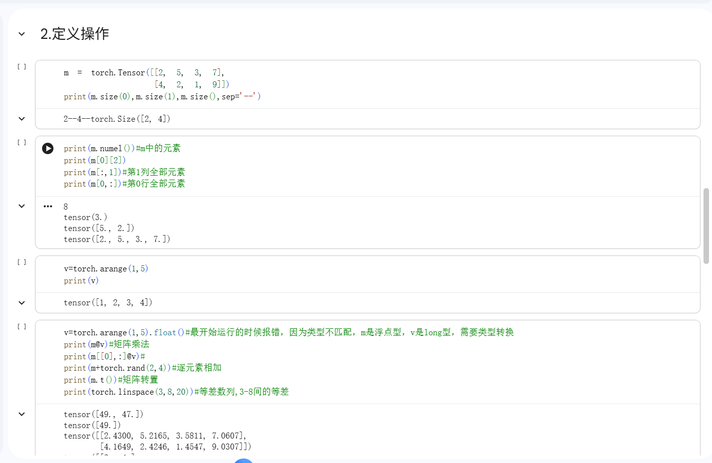
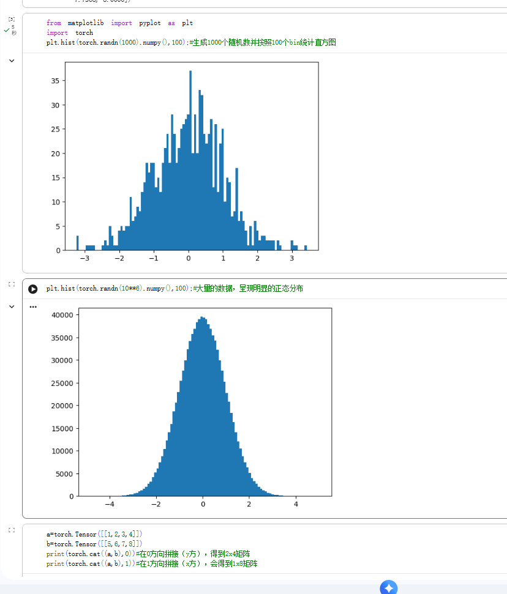
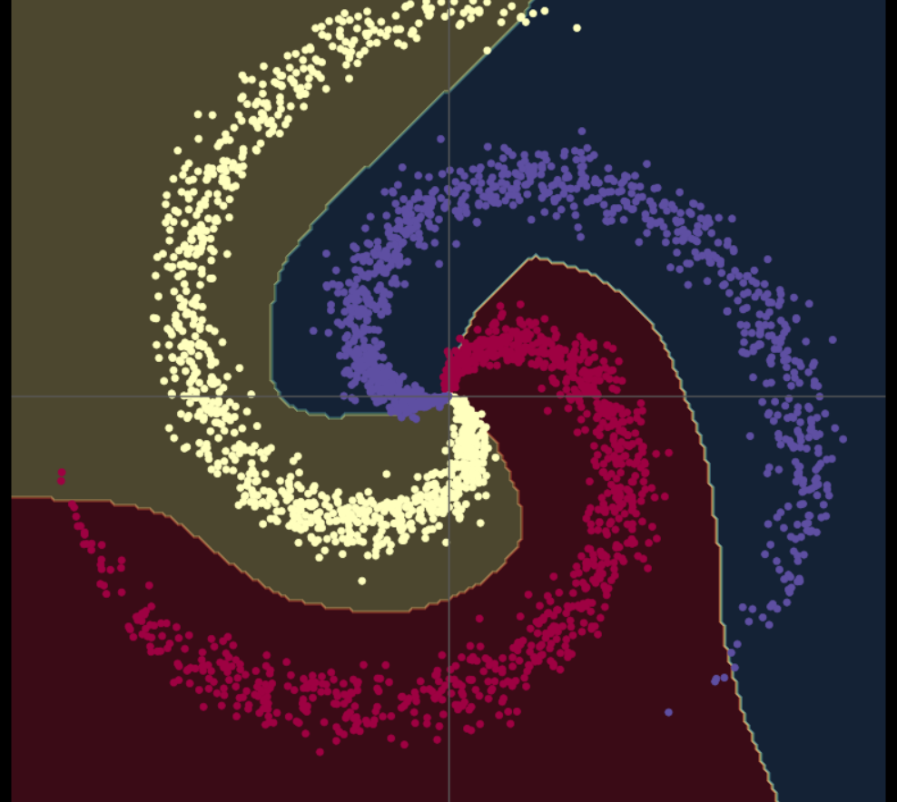

+++
date = '2025-12-03T01:04:38+08:00'
draft = false
title = 'DeepLearnProuts'

+++

## 第一周：深度学习基础

### Part1：代码练习

#### 3.1 pytorch基础练习

([Google Colab](https://colab.research.google.com/drive/1SuWdRTvEA15_l76ppUxDPie4WfjQ-sPk))

- **定义数据**

什么是 Tensor？

- **定义：** `torch.Tensor` (张量) 是 PyTorch 中用于存储和操作数据的基本数据结构。

- **形式：** 它可以表示一个**数**（标量）、**一维数组**（向量）、**二维数组**（矩阵），以及**任意维度**的数组。

  

| **描述**                    | **语法**                       | **示例**                                                     |
| --------------------------- | ------------------------------ | ------------------------------------------------------------ |
| **直接定义** (从现有数据)   | `torch.tensor(data)`           | `x = torch.tensor(666)` (标量)   `x = torch.tensor([1, 2, 3])` (向量) |
| **全1张量**                 | `torch.ones(size)`             | `x = torch.ones(2, 3)`                                       |
| **全0张量**                 | `torch.zeros(size, dtype=...)` | `x = torch.zeros(5, 3, dtype=torch.long)`                    |
| **空张量** (未初始化)       | `torch.empty(size)`            | `x = torch.empty(5, 3)`                                      |
| **随机张量** (均匀分布)     | `torch.rand(size)`             | `x = torch.rand(5, 3)`                                       |
| **随机张量** (标准正态分布) | `torch.randn(size)`            | -                                                            |

- **定义操作**

1. Tensor属性和索引

   | **描述**                     | **语法**                         | **示例**                 | **结果示例**               |
   | ---------------------------- | -------------------------------- | ------------------------ | -------------------------- |
   | **获取维度大小** (行数/列数) | `tensor.size(dim)`               | `m.size(0)`, `m.size(1)` | `2`, `4`                   |
   | **获取完整形状**             | `tensor.size()`                  | `m.size()`               | `torch.Size([2, 4])`       |
   | **获取元素总数**             | `tensor.numel()`                 | `m.numel()`              | `8`                        |
   | **索引单个元素**             | `tensor[i][j]` 或 `tensor[i, j]` | `m[0][2]`                | `tensor(3.)`               |
   | **切片 (取整列)**            | `tensor[:, j]`                   | `m[:, 1]`                | `tensor([5., 2.])`         |
   | **切片 (取整行)**            | `tensor[i, :]`                   | `m[0, :]`                | `tensor([2., 5., 3., 7.])` |

2. 常见创造操作

   | **描述**                  | **语法**                            | **示例**                   | **结果特点**                               |
   | ------------------------- | ----------------------------------- | -------------------------- | ------------------------------------------ |
   | **创建等差序列** (整数)   | `torch.arange(start, end)`          | `v = torch.arange(1, 5)`   | **不包含 `end`** (即 1 到 4)               |
   | **创建等距序列** (浮点数) | `torch.linspace(start, end, steps)` | `torch.linspace(3, 8, 20)` | **包含 `start` 和 `end`**，共 `steps` 个点 |

3. 基本数学和线性代数运算

   | **描述**       | **语法**                                            | **示例**                     | **备注**                 |
   | -------------- | --------------------------------------------------- | ---------------------------- | ------------------------ |
   | **元素级加法** | `tensor1 + tensor2`                                 | `m + torch.rand(2, 4)`       | 要求形状一致（或可广播） |
   | **矩阵乘法**   | `tensor1 @ tensor2` 或 `torch.mm(tensor1, tensor2)` | `m @ v`                      | 要求内维度匹配           |
   | **转置**       | `tensor.t()` 或 `tensor.transpose(dim0, dim1)`      | `m.t()`, `m.transpose(0, 1)` | `m.t()` 适用于 2D Tensor |

4. 运算分类

   | **运算类型**      | **常用函数示例**                                             |
   | ----------------- | ------------------------------------------------------------ |
   | **基本运算**      | `abs`, `sqrt`, `div`, `exp`, `pow`, `fmod`, `cos`, `sin`, `ceil`, `round`, `floor` |
   | **布尔运算/统计** | `gt`, `lt`, `eq`, `ne`, `max`, `min`, `topk`, `sort`         |
   | **线性代数**      | `mm` (矩阵乘法), `bmm` (批量矩阵乘法), `t` (转置), `dot`, `cross`, `inverse`, `svd` |

5. Tensor 与 NumPy 的相互转换

   

#### 3.2螺旋数据分类

([week1_2spiraldate.ipynb - Colab](https://colab.research.google.com/drive/15Ci0NneFRNpvgaRGK7YuJxxJD5Ob1HuY#scrollTo=TH5n4_qBNHDM))

直观地演示“线性模型”和“非线性神经网络”的区别，以及==激活函数==的重要性

**线性模型的准确率较低**

**添加Relu激活函数**

### Part2：问题总结

*1、AlexNet有哪些特点？为什么可以比LeNet取得更好的性能？*

​	AlexNet有更深的网络结构： AlexNet 共有 8 层（5 个卷积层 + 3 个全连接层），比早期的 LeNet（通常只有 5 层）要深得多。他使用 ReLU 激活函数,作为非线性激活函数。

​	优势： 大大加快了网络的训练速度，同时缓解了梯度消失问题。

​	使用 GPU 并行计算： AlexNet 是第一个证明使用多块 GPU 进行并行计算可以有效训练大规模深度卷积神经网络的模型。

​	大规模数据增强： 使用了大量的数据增强技术（如随机裁剪、水平翻转等），以增加训练集的多样性，提高泛化能力。

*2、激活函数有哪些作⽤？*

​	激活函数是深度学习的基石，核心作用是：引入非线性（Non-linearity）。

如果没有激活函数，无论神经网络有多少层，它都只是在进行线性变换（Wx+b）。多层线性变换的堆叠最终仍然只是一个单一的线性函数。引入激活函数后，网络才具备拟合非线性函数的能力，使其可以学习和模拟现实世界中复杂、弯曲的映射关系

​	增强模型的表达能力：通过非线性变换，网络能够提取和组合输入数据中更高级、更抽象的特征。

​	约束输出范围

*3、梯度消失现象是什么？*

梯度消失现象是指在训练深层神经网络时，由于反向传播机制，靠近输入层的参数梯度会变得非常小甚至趋近于零，导致这些层几乎无法获得有效的更新信号。靠近输入层的权重（W）几乎停滞不前，不进行学习。

当有很多层时，许多小于 1 的数连续相乘，结果会变得指数级地小。

*4、神经网络是更宽好还是更深好？*

在现代深度学习中，在参数总量相当的情况下，更深（Deep）的网络通常优于更宽（Wide）的网络。

更深网络的优势:

​	特征层次结构（Hierarchical Feature Learning）：深层网络能够逐步学习从简单到复杂的抽象特征。例如：第一层学到边缘和角点；中间层学到纹理和局部图案；高层学到整体物体或概念。这种分层的特征表达能力对于复杂任务（如图像识别）至关重要。

​	参数效率（Parameter Efficiency）：研究表明，一个深层、窄的网络通常可以用比一个浅层、宽的网络更少的参数，来表达相同复杂度的函数。这意味着在计算资源有限的情况下，深层网络更高效。

​	更好的泛化能力：深度通常有助于模型更好地泛化到未见过的数据。

*5、为什么要使⽤Softmax?*

输出具有统计学意义，可以直接解释为模型对该输入属于每个类别的置信度（概率）。

配合损失函数：Softmax 的输出（概率）是计算交叉熵损失（Cross-Entropy Loss） 的必要输入。交叉熵损失是分类任务中最常用的损失函数之一，它度量了预测概率分布与真实标签分布之间的差异。

*6、SGD 和 Adam 哪个更有效？*

SGD基础优化器，通常搭配动量（Momentum）。所有参数使用统一的学习率。在某些大型视觉任务中，如果精心调优，有时能达到更好的最终泛化性能。需要手动调整学习率，收敛速度慢。

Adam自适应学习率（Adaptive Learning Rate）。为每个参数动态调整学习率，并结合了动量机制。收敛速度快，容易使用，是大多数任务的默认首选。有时被认为泛化性能略逊于经过精细调优的 SGD。

## 第二周：卷积神经网络

### Part1：知识学习

卷积神经网络（Convolutional Neural Network，简称 CNN）是一种专门用于处理具有网格结构数据（如图像）的深度学习模型。其基本结构由多个关键层组成。

1. **输入层**

   - 接收原始图像数据，通常表示为三维张量：高度 × 宽度 × 通道数（例如，224×224×3 表示一张 224×224 像素、RGB 三通道的彩色图像）。

2. **卷积层**

   - 核心操作：卷积。使用多个可学习的**滤波器**（也称卷积核，kernel，filter）在输入图像上滑动，提取局部特征（如边缘、纹理等）。
   - 每个滤波器生成一个**特征图**（feature map），多个滤波器堆叠形成输出的多通道特征图。
   - 优点：**参数共享**和**局部连接**，大幅减少参数量并保留空间结构信息。

3. **激活函数层**

   - 通常在卷积后立即应用非线性激活函数。

   - 引入非线性，使网络能够学习复杂模式。

4. **池化层**

   - 下采样操作，用于降低特征图的空间维度（高度和宽度），减少计算量并增强平移不变性。
   - 常见类型：**最大池化**（Max Pooling）和平均池化。
   - 通常不引入可学习参数。

5. **全连接层**

   - 将前面提取的高级特征“展平”成一维向量，输入到传统神经网络层中。
   - 通常位于网络末端，用于分类或回归任务。
   - 例如，在图像分类中，最后一个全连接层的输出维度等于类别数，配合 Softmax 激活函数输出概率分布。

6. **输出层**

   - 根据任务类型选择激活函数：
     - 多分类：Softmax
     - 二分类：Sigmoid
     - 回归：线性激活（无激活函数）  

### Part2:代码练习

#### 4.1 MNIST数据集分类

[Google Colab](https://colab.research.google.com/drive/13ABrD6OwrTZtLgOGNxc4Kej--n6Hocss)

该代码实现了一个对比实验，探究卷积神经网络（CNN）与全连接神经网络（FCN/MLP）对图像空间结构的不同依赖程度。
实验流程共分为五个主要步骤：

1. 数据准备与预处理
    加载数据：使用 torchvision.datasets 下载并加载 MNIST 手写数字数据集。
    预处理：定义 transforms，将图像转换为 Tensor 并进行归一化（Normalize）。
    数据加载器：构建 DataLoader，设置 batch_size 和 shuffle 参数，用于批量读取训练集和测试集。  

  

2. 模型定义
    为了控制变量，代码构建了两个参数量相近（约 6400 个参数）的模型：
- 全连接网络 (FC2Layer)：
  结构：输入层 -> 隐藏层1 -> 隐藏层2 -> 输出层。
  处理方式：在 forward 函数中，首先通过 view 将 28×28的二维图像展平为 784维的一维向量，完全舍弃了图像的二维结构。
- 卷积神经网络 (CNN)：
    结构：包含两个卷积层（Conv2d），每个卷积层后接 ReLU 激活和最大池化（Max_pool2d），最后接全连接层输出。
    处理方式：保留图像的二维空间结构进行特征提取。
3. 基准实验（原始数据训练）
     训练流程：定义标准的 train 和 test 函数，使用负对数似然损失（NLL Loss）和随机梯度下降（SGD）优化器。
       执行：分别在原始 MNIST 数据集上训练 FCN 和 CNN。
       结果：CNN 的测试准确率（~96%）显著高于 FCN（~87%），验证了 CNN 在提取图像特征上的优势。

     

4. 扰动实验设计（像素打乱）
     为了验证模型对空间信息的依赖，代码引入了**像素重排**机制：
       生成置换索引：使用 torch.randperm(784) 生成一个固定的随机序列。
       数据处理函数：定义 perm_pixel 函数。该函数按照上述生成的随机序列，将图像中的所有像素点重新排列。打乱后的图像在视觉上呈现为杂乱的噪点，破坏了像素间的邻域关系（如边缘、形状），但保留了像素值的统计特征。
       修改训练逻辑：定义 train_perm 和 test_perm，在输入模型前先对数据应用像素打乱。

     

5. 对照实验（打乱数据训练）
     执行：使用打乱后的数据重新训练上述两个模型。
       实现现象：
       FCN：性能基本保持不变。因为 FCN 无论是否打乱，都是将输入视为独立特征的一维向量，不依赖像素的空间位置。
       CNN：性能显著下降。因为像素打乱破坏了图像的局部特征（Locality），导致卷积核无法提取有效的几何特征（如线条、轮廓），使其退化为效率低下的特征提取器。

### Part3:问题总结

- 1、dataloader 里面 shuffle 取不同值有什么区别？

  shuffle=True：
  	每个 epoch 开始前，训练数据会被随机打乱顺序。
  	作用：打破数据顺序的潜在模式（比如按类别排序），有助于模型更好地泛化，避免陷入局部	最优或学习到数据顺序的伪模式。
  shuffle=False：
  	数据按原始顺序加载（通常是按类别或采集顺序排列）。
  	作用：保证数据顺序可复现，常用于验证集或测试集（因为不需要打乱，且有时需要与标签	对应做分析）。

  

- 2、transform 里，取了不同值，这个有什么区别？

  1. 数据分布变化：比如 `Normalize(mean, std)` 会将像素值标准化，影响输入数据的均值和方差。

  2. 数据增强效果：如 `RandomCrop`, `ColorJitter` 能增加训练数据的多样性，提升模型鲁棒性。

  3. 输入尺寸统一：如 `Resize(224)` 确保所有图像输入尺寸一致，适配网络（如 ResNet）。

  4. 训练 vs 推理差异：训练时常用随机增强（如 `RandomHorizontalFlip`），而测试时通常用确定性变换

     

- 3、epoch 和 batch 的区别？

  Batch（批次）：
  	一次前向 + 反向传播所用的样本数量。由于内存限制，不能一次性把全部数据送入模型，所以将数据分成多个 batch。例如：总数据 1000，batch_size=100 → 每个 epoch 有 10 个 batch。

  Epoch（轮次）：
  	模型完整遍历一次全部训练数据的过程，一个 epoch 包含多个 batch，通常训练多个 epoch（如 10, 50, 100）以让模型充分学习。

  

- 4、1x1的卷积和 FC 有什么区别？主要起什么作⽤？

    区别：
  
    ​	1×1 卷积可以处理任意空间尺寸的输入（H×W×C），而全连接层（FC）要求输入维度固定（如512维）。
    ​	1×1 卷积在所有空间位置共享同一组权重，仅对通道做线性组合，不改变 H 和 W，只调整通道数；而 FC 为每个输入元素分配独立权重，将整个输入展平后做全局线性变换，输出为无空间结构的向量。
    因此，1×1 卷积保留空间信息，FC 会丢失空间结构。
    
    1×1 卷积的主要作用：
    
    ​	通道降维/升维（如 ResNet 中的 bottleneck）。
    ​	特征融合：在不改变空间结构的前提下，融合不同通道的信息。
    ​	替代 FC 实现更高效、保留空间信息的分类头（如在全卷积网络 FCN 中做像素级预测）。
    ​	增加非线性（配合激活函数，如 ReLU）。

